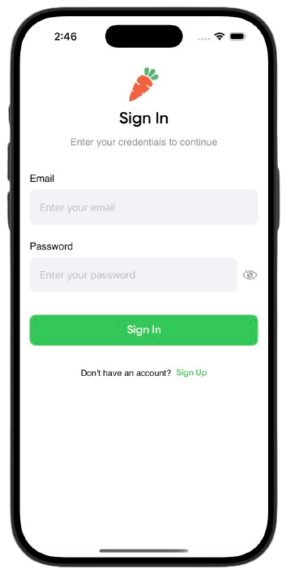
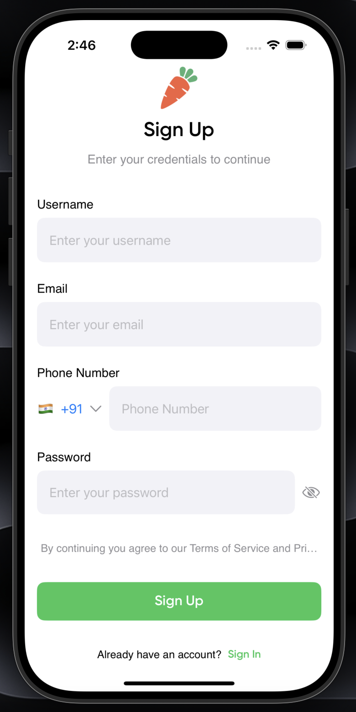
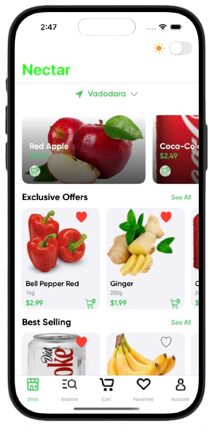
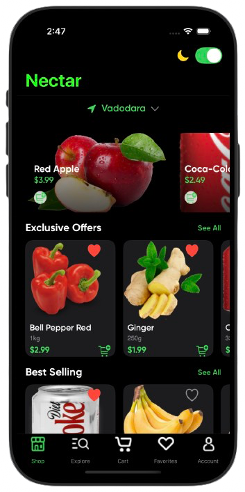
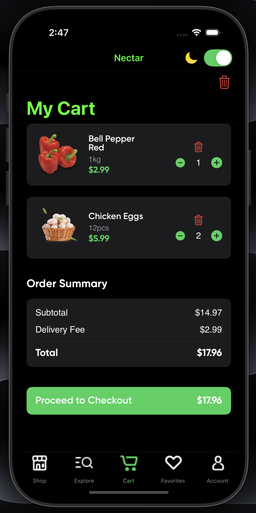
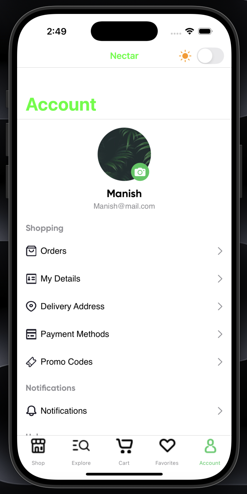
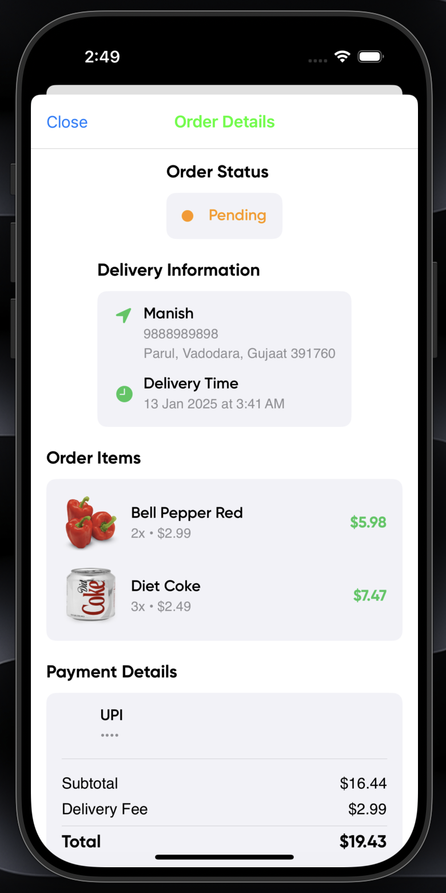

# Nectar: A Grocery Delivery App

## About My Project
Nectar is a grocery delivery app developed with the help of **Cursor AI** and the **SweetPad** extension. This project was created within a tight time frame, focusing on learning by experimentation and reverse engineering. My goal was to understand iOS Development.

## Powered by Cursor AI and SweetPad
Cursor AI and the SweetPad extension played a crucial role in the development of Nectar. These tools allowed me to efficiently prototype, iterate, and refine my ideas, enabling me to build a base level working app.

## Learning by Experimenting
My development process was driven by a hands-on, experiential approach. By embracing the philosophy of learning by doing and reverse engineering.

## Features
- **Sign In and Sign Up**: A feature to create accounts and log in (note: actual authentication is not yet implemented).
- **Location Selection**: Users can select their location by searching or using a live map.
- **Product Search and Filtering**: Easily search for products and apply filters to find items quickly.
- **Add to Favourites**: Save products to a favourites list for quick access later.
- **Add to Cart**: Users can add products to their shopping cart for easy checkout.
- **Checkout Process**: Complete the purchase by adding an address and payment method.
- **Personal Details**: Users can add personal information and upload a profile picture.
- **Ongoing Order Details**: View details of current orders in progress.
- **Log Out**: Easily log out of the application when finished.

> **Note:** Many features are not fully optimized, and some are demographic. This project was primarily a learning experience in iOS development.

## Screenshots
Click on any of the images to see the video...

## Contributing
If you'd like to contribute to Nectar, feel free to fork the repository and submit a pull request. Any contributions are welcome!

---

  

